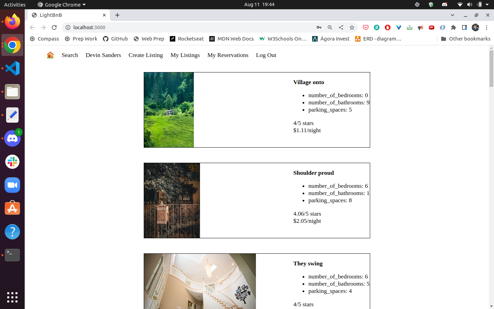
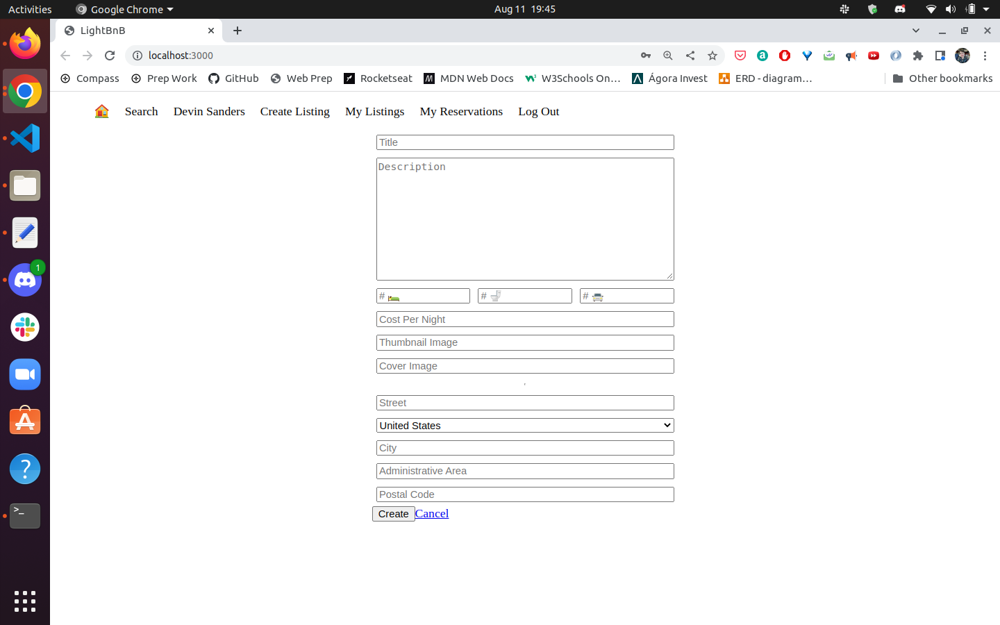

# LightBnB

LightBnB allows home owners to rent out their homes to people on vacation, creating an alternative to hotels and bed and breakfasts. 

This project is part of my Lighthouse Labs studies, practicing my back-end skills, and also Node, SQL and PostgreSQL skills.

I started this project by designing the database and creating an ERD for the tables, then created the database and the tables using the ERD.
After that, was added some fake data to the database to make testing queries easier, then some queries were written.
Finally, I connected the database to a javascript application so that I could interact with the data from a web page.

## Final Product

### Properties Listing

### Create Listing

## Getting Started

1. [Create](https://docs.github.com/en/repositories/creating-and-managing-repositories/creating-a-repository-from-a-template) a new repository using this repository as a template.
2. Clone your repository onto your local device.
3. Install dependencies using the `npm install` command.
3. Start the web server using the `npm run local` command on LightBnB_WebApp-master directory.
4. Go to <http://localhost:3000/> in your browser.

## Dependencies

- node-postgres
- Node 5.10.x or above

## Enjoy!

